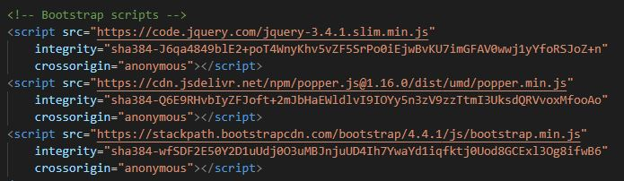
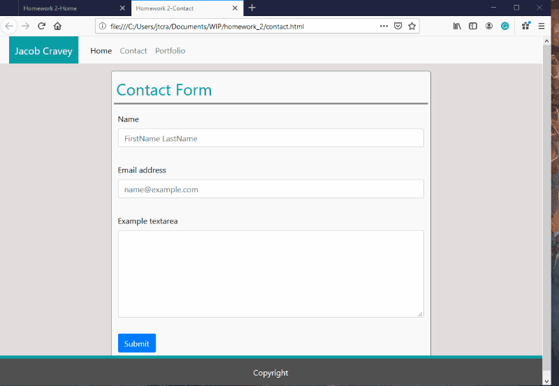

# homework_2

Description: This assigment was to test our ability to use Bootstrap to create dynamic grids and layouts that could adapt to
different view ports and resize content accordingly. The languages we used were HTML and CSS, and we were required to link the
Bootstrap styles and JS/jquery to use the bootstrap library.

This is a screenshot of the link used to access the Bootstrap style library. Notice I put my own CSS after it, which allows me
to overwrite any of thier style options and use my own instead.

This is a screen shot of the scrip links required to allow bootstraps scripted functions to work.

Here are some gifs of the scaling taking place:

